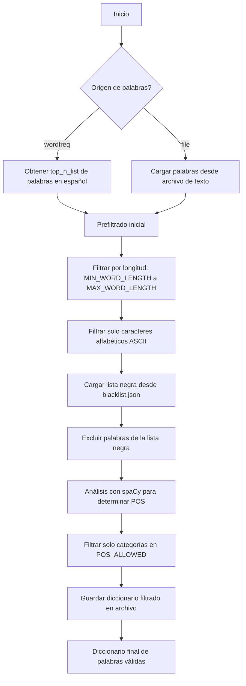
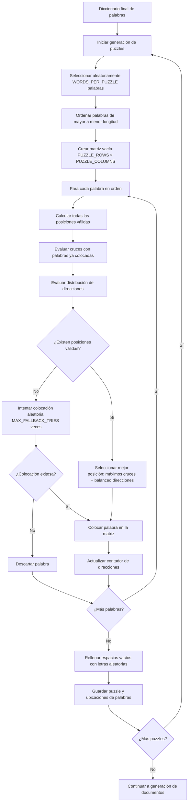
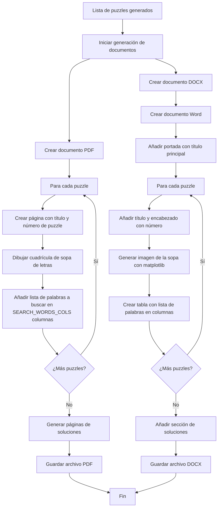

# Generador de Sopas de Letras

Este proyecto es un generador automático de sopas de letras en español, capaz de crear 365 puzzles diferentes (uno para cada día del año) con palabras frecuentes del idioma español. El programa genera tanto archivos PDF como DOCX con los puzzles y sus soluciones.

## Características Principales

- Genera 365 sopas de letras diferentes (configurable mediante `TOTAL_PUZZLES`)
- Cada puzzle contiene 50 palabras (configurable mediante `WORDS_PER_PUZZLE`)
- Utiliza palabras frecuentes en español obtenidas de la biblioteca `wordfreq` o de un archivo de texto
- Verifica ortografía y categoría gramatical mediante `spaCy` y `pyenchant`
- Permite excluir palabras mediante una lista negra en formato JSON
- Genera documentos en formato PDF y DOCX con diseño profesional
- Muestra barras de progreso durante la generación para seguimiento del proceso
- Optimiza la colocación de palabras para maximizar cruces entre ellas
- Incluye soluciones al final de los documentos con visualización clara
- Configurable en múltiples aspectos: dimensiones, fuentes, diseño, etc.

## Requisitos

### Bibliotecas Python

```
python 3.6+
numpy
tqdm
wordfreq
matplotlib
python-docx
pyenchant (con diccionario es_ES)
spacy (con modelo es_core_news_lg)
```

### Archivos

- `main.py`: Punto de entrada principal de la aplicación
- `config.py`: Archivo de configuración con constantes y parámetros
- `data_loader.py`: Módulo para cargar y filtrar palabras
- `generator.py`: Módulo para generar las sopas de letras
- `export_pdf.py`: Módulo para exportar a formato PDF
- `export_docx.py`: Módulo para exportar a formato DOCX
- `drawing.py`: Utilidades para dibujar las sopas y soluciones
- `blacklist.json`: Lista de palabras a excluir (formato JSON array)
- `palabras_todas.txt`: Archivo opcional con palabras personalizadas (si se configura `WORD_SOURCE = "file"`)

## Instalación

1. Clona o descarga este repositorio
2. Instala las dependencias:

```bash
pip install numpy tqdm wordfreq matplotlib python-docx pyenchant spacy
python -m spacy download es_core_news_lg
```

3. Asegúrate de tener instalado el diccionario español para pyenchant:
   - En Windows: Se instala automáticamente con pyenchant
   - En Linux: `sudo apt-get install myspell-es`
   - En macOS: `brew install hunspell && brew install hunspell-es`

4. Crea un archivo `blacklist.json` con palabras a excluir (opcional):

```json
[
  "palabra1",
  "palabra2",
  "palabrainapropiada"
]
```

## Uso

Ejecuta el script principal:

```bash
python main.py
```

El programa generará los siguientes archivos en el directorio actual:
- `365_word_search_puzzles.pdf`: Documento PDF con todos los puzzles y soluciones
- `365_word_search_puzzles.docx`: Documento Word con todos los puzzles y soluciones
- `[origen]_[archivo]_filtered.txt`: Archivo de texto con las palabras filtradas que cumplen todos los criterios

## Configuración

Puedes modificar las siguientes constantes en el archivo `config.py` para personalizar la generación:

### Configuración General

```python
# Origen de palabras: "wordfreq" o "file"
WORD_SOURCE         = "file"
WORD_SOURCE_FILE    = "palabras_todas.txt"  
MAX_RAW_WORDS       = 100000

# Filtrado de la lista inicial
MIN_WORD_LENGTH     = 4
MAX_WORD_LENGTH     = 10
POS_ALLOWED         = {"NOUN", "VERB", "ADV"}  # Categorías gramaticales permitidas
BLACKLIST_FILE      = "blacklist.json"

# Generación de la sopa
WORDS_PER_PUZZLE    = 50
PUZZLE_ROWS         = 14
PUZZLE_COLUMNS      = 17
MAX_FALLBACK_TRIES  = 200  # Intentos máximos para colocar una palabra
TOTAL_PUZZLES       = 365  # Número total de puzzles a generar
```

### Configuración de Exportación

```python
# Exportación a PDF
PDF_PAGE_SIZE       = (8.27, 11.69)  # en pulgadas (A4)
PDF_PUZZLE_AREA     = dict(left=0.1, bottom=0.30, width=0.8, height=0.55)
SEARCH_WORDS_COLS   = 5  # Columnas para listar palabras

# Exportación a DOCX
SOLUTION_PER_PAGE   = 15  # Soluciones por página
SOLUTION_COLS       = 3   # Columnas de soluciones
DOCX_IMAGE_WIDTH    = 6   # Ancho de imagen en pulgadas
```

## Arquitectura y Flujo de Datos

El generador sigue un flujo de procesamiento secuencial dividido en varias etapas claramente definidas. A continuación se presentan diagramas detallados de cada fase del proceso.

### 1. Obtención y Filtrado de Palabras



#### Detalles del Proceso de Filtrado

1. **Obtención de palabras crudas**:
   - Desde `wordfreq`: Utiliza `top_n_list("es", MAX_RAW_WORDS)` para obtener las palabras más frecuentes en español
   - Desde archivo: Lee línea por línea el archivo especificado en `WORD_SOURCE_FILE`

2. **Prefiltrado**:
   - Longitud: Solo palabras entre `MIN_WORD_LENGTH` y `MAX_WORD_LENGTH` caracteres
   - Caracteres: Solo palabras con caracteres ASCII alfabéticos (a-z, A-Z)
   - Exclusión: Elimina palabras presentes en la lista negra (`blacklist.json`)

3. **Análisis lingüístico**:
   - Utiliza `spaCy` con el modelo `es_core_news_lg` para analizar cada palabra
   - Filtra solo palabras cuya categoría gramatical (POS) está en `POS_ALLOWED`
   - Categorías permitidas por defecto: sustantivos (NOUN), verbos (VERB) y adverbios (ADV)

4. **Resultado**:
   - Guarda el diccionario filtrado en un archivo de texto para referencia
   - Devuelve la lista final de palabras válidas para la generación de puzzles

### 2. Generación de Puzzles



#### Detalles del Algoritmo de Colocación

1. **Selección de palabras**:
   - Selecciona aleatoriamente `WORDS_PER_PUZZLE` palabras del diccionario filtrado
   - Mantiene un registro de palabras ya utilizadas para evitar repeticiones entre puzzles
   - Cuando se agotan las palabras disponibles, reinicia el conjunto de palabras usadas

2. **Ordenamiento estratégico**:
   - Ordena las palabras de mayor a menor longitud para maximizar la probabilidad de cruces
   - Las palabras más largas se colocan primero, creando más oportunidades para cruces

3. **Algoritmo de colocación óptima**:
   - Para cada palabra, evalúa todas las posiciones y direcciones posibles
   - Calcula para cada posición:
     - Número de cruces con palabras ya colocadas (letras compartidas)
     - Distribución actual de direcciones (para balancear horizontales, verticales y diagonales)
   - Selecciona la posición que maximiza cruces y balancea direcciones

4. **Mecanismo de fallback**:
   - Si no encuentra posición óptima, intenta hasta `MAX_FALLBACK_TRIES` colocaciones aleatorias
   - Si aún así no puede colocar la palabra, la descarta y continúa con la siguiente

5. **Finalización del puzzle**:
   - Rellena los espacios vacíos con letras aleatorias del alfabeto español
   - Almacena la matriz final y las ubicaciones de cada palabra para la visualización

### 3. Generación de Documentos



#### Detalles de la Generación de Documentos

1. **Generación de PDF**:
   - Utiliza `matplotlib` y `PdfPages` para crear un documento PDF
   - Para cada puzzle:
     - Crea una página con título y número de puzzle
     - Dibuja la cuadrícula de la sopa de letras con espaciado uniforme
     - Añade la lista de palabras a buscar en columnas (`SEARCH_WORDS_COLS`)
   - Para las soluciones:
     - Agrupa múltiples soluciones por página (`SOLUTION_PER_PAGE`)
     - Dibuja líneas rojas conectando el inicio y fin de cada palabra
     - Etiqueta cada solución con su número de puzzle

2. **Generación de DOCX**:
   - Utiliza `python-docx` para crear un documento Word
   - Añade una portada con título principal
   - Para cada puzzle:
     - Crea un encabezado con número y cantidad de palabras
     - Genera una imagen de la sopa de letras usando `matplotlib`
     - Crea una tabla con la lista de palabras a buscar
   - Para las soluciones:
     - Crea una sección separada con título "Soluciones"
     - Genera una tabla con múltiples soluciones por página
     - Cada celda contiene una imagen miniatura con las palabras marcadas

## Diagrama de Flujo Completo

```mermaid
flowchart TD
    %% Inicio y configuración
    Start([Inicio]) --> LoadConfig[Cargar configuración desde config.py]
    LoadConfig --> CheckDeps[Verificar dependencias: spaCy, wordfreq, etc.]
    CheckDeps --> GetWords{Obtener palabras}
    
    %% Obtención de palabras
    GetWords -->|wordfreq| WordFreq[top_n_list español con MAX_RAW_WORDS]
    GetWords -->|archivo| ReadFile[Leer archivo WORD_SOURCE_FILE]
    WordFreq --> RawWords[Lista de palabras crudas]
    ReadFile --> RawWords
    
    %% Filtrado de palabras
    RawWords --> LoadBlacklist[Cargar blacklist.json]
    LoadBlacklist --> PreFilter[Prefiltrado: longitud y caracteres]
    PreFilter --> SpacyAnalysis[Análisis con spaCy]
    SpacyAnalysis --> POSFilter[Filtrar por categoría gramatical]
    POSFilter --> SaveFiltered[Guardar diccionario filtrado]
    SaveFiltered --> FilteredDict[Diccionario final]
    
    %% Generación de puzzles
    FilteredDict --> InitPuzzleGen[Iniciar generación de puzzles]
    InitPuzzleGen --> TrackUsed[Inicializar conjunto de palabras usadas]
    TrackUsed --> PuzzleLoop[Bucle de generación de puzzles]
    
    %% Bucle de generación
    PuzzleLoop --> SelectWords[Seleccionar WORDS_PER_PUZZLE palabras aleatorias]
    SelectWords --> CheckUsed{¿Suficientes palabras?}
    CheckUsed -->|No| ResetUsed[Reiniciar palabras usadas]
    ResetUsed --> SelectWords
    CheckUsed -->|Sí| SortWords[Ordenar por longitud descendente]
    SortWords --> CreateMatrix[Crear matriz vacía PUZZLE_ROWS × PUZZLE_COLUMNS]
    CreateMatrix --> InitDirCount[Inicializar contador de direcciones]
    InitDirCount --> WordLoop[Bucle de colocación de palabras]
    
    %% Colocación de palabras
    WordLoop --> FindPositions[Calcular todas las posiciones válidas]
    FindPositions --> EvalCrosses[Evaluar cruces con palabras existentes]
    EvalCrosses --> EvalDirs[Evaluar distribución de direcciones]
    EvalDirs --> HasValidPos{¿Posiciones válidas?}
    HasValidPos -->|Sí| SelectBest[Seleccionar mejor posición]
    HasValidPos -->|No| TryRandom[Intentar MAX_FALLBACK_TRIES colocaciones aleatorias]
    TryRandom --> RandomSuccess{¿Exitoso?}
    RandomSuccess -->|No| DiscardWord[Descartar palabra]
    RandomSuccess -->|Sí| PlaceWord[Colocar palabra en matriz]
    SelectBest --> PlaceWord
    PlaceWord --> UpdateDirCount[Actualizar contador de direcciones]
    UpdateDirCount --> MoreWords{¿Más palabras?}
    DiscardWord --> MoreWords
    MoreWords -->|Sí| WordLoop
    MoreWords -->|No| FillEmpty[Rellenar espacios vacíos con letras aleatorias]
    
    %% Finalización de puzzle
    FillEmpty --> StorePuzzle[Almacenar puzzle y ubicaciones]
    StorePuzzle --> MorePuzzles{¿Más puzzles < TOTAL_PUZZLES?}
    MorePuzzles -->|Sí| PuzzleLoop
    MorePuzzles -->|No| AllPuzzles[Lista completa de puzzles]
    
    %% Generación de documentos
    AllPuzzles --> PDFGen[Generar PDF con matplotlib]
    AllPuzzles --> DOCXGen[Generar DOCX con python-docx]
    
    %% Generación de PDF
    PDFGen --> PDFInit[Inicializar PdfPages]
    PDFInit --> PDFPuzzleLoop[Para cada puzzle]
    PDFPuzzleLoop --> PDFCreatePage[Crear figura con tamaño PDF_PAGE_SIZE]
    PDFCreatePage --> PDFAddTitle[Añadir título con número de puzzle]
    PDFAddTitle --> PDFDrawGrid[Dibujar cuadrícula con letras]
    PDFDrawGrid --> PDFAddWords[Añadir lista de palabras en SEARCH_WORDS_COLS columnas]
    PDFAddWords --> PDFSavePage[Guardar página en documento]
    PDFSavePage --> PDFMorePuzzles{¿Más puzzles?}
    PDFMorePuzzles -->|Sí| PDFPuzzleLoop
    PDFMorePuzzles -->|No| PDFSolutions[Generar páginas de soluciones]
    PDFSolutions --> SavePDF[Guardar archivo PDF]
    
    %% Generación de DOCX
    DOCXGen --> DOCXCreate[Crear Document()]
    DOCXCreate --> DOCXCover[Añadir portada con título]
    DOCXCover --> DOCXPuzzleLoop[Para cada puzzle]
    DOCXPuzzleLoop --> DOCXAddTitle[Añadir título con nivel DOCX_TITLE_LEVEL]
    DOCXAddTitle --> DOCXCreateImage[Generar imagen con matplotlib]
    DOCXCreateImage --> DOCXAddImage[Añadir imagen con ancho DOCX_IMAGE_WIDTH]
    DOCXAddImage --> DOCXAddTable[Crear tabla de palabras con alineación DOCX_TABLE_ALIGN]
    DOCXAddTable --> DOCXMorePuzzles{¿Más puzzles?}
    DOCXMorePuzzles -->|Sí| DOCXPuzzleLoop
    DOCXMorePuzzles -->|No| DOCXSolutions[Añadir sección de soluciones]
    DOCXSolutions --> DOCXSolTable[Crear tabla con SOLUTION_COLS columnas]
    DOCXSolTable --> DOCXSolLoop[Para cada SOLUTION_PER_PAGE soluciones]
    DOCXSolLoop --> DOCXDrawSol[Dibujar solución con líneas rojas]
    DOCXDrawSol --> DOCXAddSolImg[Añadir imagen con ancho DOCX_SOL_IMG_WIDTH]
    DOCXAddSolImg --> DOCXMoreSol{¿Más soluciones?}
    DOCXMoreSol -->|Sí| DOCXSolLoop
    DOCXMoreSol -->|No| SaveDOCX[Guardar archivo DOCX]
    
    %% Finalización
    SavePDF --> End([Fin])
    SaveDOCX --> End
```

## Estructura de Datos

### Principales Estructuras

1. **Matriz del Puzzle**: Lista bidimensional (`list[list[str]]`) que representa la cuadrícula de la sopa de letras.

2. **Ubicaciones de Palabras**: Diccionario (`dict[str, tuple[tuple[int,int], tuple[int,int]]]`) que mapea cada palabra a sus coordenadas de inicio y fin.

3. **Contador de Direcciones**: Diccionario (`dict[tuple[int,int], int]`) que registra cuántas palabras se han colocado en cada dirección para balancear la distribución.

4. **Lista de Puzzles**: Lista de tuplas (`list[tuple[list[list[str]], list[str], dict]]`) donde cada tupla contiene:
   - La matriz del puzzle
   - La lista de palabras a buscar
   - El diccionario de ubicaciones

### Flujo de Datos en Memoria

```
Palabras crudas → Palabras filtradas → Selección para puzzle → 
Matriz de puzzle → Documento PDF/DOCX
```

## Optimizaciones y Algoritmos

### Algoritmo de Colocación Óptima

El algoritmo utiliza una estrategia de optimización multi-objetivo para colocar cada palabra:

1. **Maximización de cruces**: Prioriza posiciones donde la palabra comparte más letras con palabras ya colocadas.

2. **Balanceo de direcciones**: Entre posiciones con igual número de cruces, selecciona aquella en la dirección menos utilizada.

3. **Fallback aleatorio**: Si no encuentra posición óptima, intenta colocaciones aleatorias como mecanismo de respaldo.

### Optimización de Rendimiento

- **Ordenamiento estratégico**: Coloca primero las palabras más largas para maximizar oportunidades de cruce.
- **Prefiltrado eficiente**: Aplica filtros simples antes del análisis lingüístico más costoso.
- **Procesamiento por lotes**: Utiliza `spaCy.pipe()` para análisis eficiente de grandes conjuntos de palabras.
- **Barras de progreso**: Implementa `tqdm` para seguimiento visual del proceso.
- **Generación paralela**: Utiliza múltiples hilos para generar puzzles simultáneamente cuando es posible.

## Limitaciones y Posibles Mejoras

- **Colocación de palabras**: El algoritmo puede no colocar todas las palabras si no encuentra posiciones adecuadas, especialmente en puzzles muy densos.
- **Rendimiento**: La generación de puzzles grandes o numerosos puede ser computacionalmente intensiva.
- **Memoria**: Para diccionarios muy grandes, el consumo de memoria puede ser significativo.
- **Posibles mejoras**:
  - Implementar un algoritmo de backtracking para optimizar globalmente la colocación de palabras.
  - Añadir soporte para otros idiomas mediante configuración de modelos lingüísticos.
  - Desarrollar una interfaz gráfica para facilitar la configuración y visualización.
  - Implementar generación de puzzles temáticos basados en categorías semánticas.
  - Optimizar el algoritmo de colocación para maximizar la densidad de palabras.
  - Añadir opciones para personalizar el diseño visual de los documentos generados.
  - Implementar exportación a formatos adicionales (HTML, SVG, PNG).

## Licencia

Este proyecto es software libre y puede ser distribuido bajo los términos de la licencia MIT.

## Autor

Desarrollado como herramienta educativa para la generación de material didáctico en español.