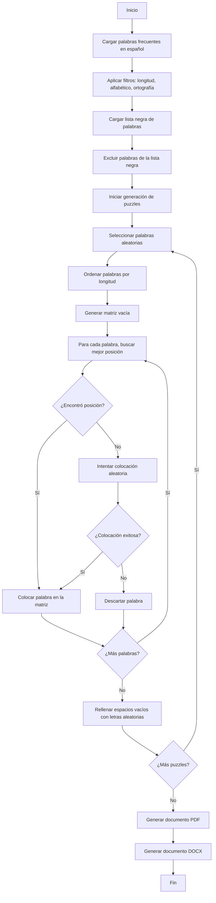

# Generador de Sopas de Letras

Este proyecto es un generador automático de sopas de letras en español, capaz de crear 365 puzzles diferentes (uno para cada día del año) con palabras frecuentes del idioma español. El programa genera tanto archivos PDF como DOCX con los puzzles y sus soluciones.

## Características Principales

- Genera 365 sopas de letras diferentes (configurable)
- Cada puzzle contiene 50 palabras (configurable)
- Utiliza palabras frecuentes en español
- Verifica ortografía mediante diccionario español
- Permite excluir palabras mediante una lista negra
- Genera documentos en formato PDF y DOCX
- Muestra barras de progreso durante la generación
- Optimiza la colocación de palabras para maximizar cruces
- Incluye soluciones al final de los documentos

## Requisitos

### Bibliotecas Python

```
python 3.6+
numpy
tqdm
wordfreq
matplotlib
python-docx
pyenchant (con diccionario es_ES)
```

### Archivos

- `GenerarSopaLetras.py`: Script principal
- `blacklist.json`: Lista de palabras a excluir (formato JSON array)

## Instalación

1. Clona o descarga este repositorio
2. Instala las dependencias:

```bash
pip install numpy tqdm wordfreq matplotlib python-docx pyenchant
```

3. Asegúrate de tener instalado el diccionario español para pyenchant:
   - En Windows: Se instala automáticamente con pyenchant
   - En Linux: `sudo apt-get install myspell-es`
   - En macOS: `brew install hunspell && brew install hunspell-es`

4. Crea un archivo `blacklist.json` con palabras a excluir (opcional):

```json
[
  "palabra1",
  "palabra2",
  "palabrainapropiada"
]
```

## Uso

Ejecuta el script principal:

```bash
python GenerarSopaLetras.py
```

El programa generará dos archivos en el directorio actual:
- `xxx_word_search_puzzles.pdf`: Documento PDF con todos los puzzles y soluciones
- `xxx_word_search_puzzles.docx`: Documento Word con todos los puzzles y soluciones

## Configuración

Puedes modificar las siguientes constantes al inicio del script:

```python
WORDS_PER_PUZZLE = 50  # Palabras por puzzle
PUZZLE_ROWS, PUZZLE_COLUMNS = 14, 17  # Dimensiones de la sopa de letras
TOTAL_PUZZLES = 365  # Número total de puzzles a generar
SEARCH_WORDS_COLS = 5  # Número de columnas para listar palabras
```

## Funcionamiento Interno

### Selección de Palabras

El programa utiliza la biblioteca `wordfreq` para obtener las palabras más frecuentes en español. Luego aplica varios filtros:

1. Longitud entre 4 y 10 caracteres
2. Solo caracteres alfabéticos
3. Verificación ortográfica mediante `pyenchant`
4. Exclusión de palabras en la lista negra

### Generación de Sopas de Letras

Para cada puzzle, el algoritmo:

1. Ordena las palabras de mayor a menor longitud para maximizar cruces
2. Para cada palabra, busca la mejor posición considerando:
   - Cruces con palabras ya colocadas
   - Distribución equilibrada de direcciones
3. Si no encuentra posición óptima, intenta colocación aleatoria
4. Rellena espacios vacíos con letras aleatorias

### Creación de Documentos

El programa genera dos tipos de documentos:

1. **PDF**: Utiliza matplotlib para renderizar cada puzzle y sus soluciones
2. **DOCX**: Utiliza python-docx para crear un documento Word con todos los puzzles

Ambos documentos incluyen:
- Una página por puzzle con la sopa de letras y la lista de palabras a buscar
- Páginas de soluciones al final (10 soluciones por página)

## Diagrama de Flujo



## Limitaciones y Posibles Mejoras

- El algoritmo puede no colocar todas las palabras si no encuentra posiciones adecuadas
- La generación de puzzles grandes puede ser lenta
- Se podría añadir soporte para otros idiomas
- Posibilidad de generar puzzles con temas específicos
- Interfaz gráfica para facilitar la configuración

## Licencia

Este proyecto es software libre y puede ser distribuido bajo los términos de la licencia MIT.

## Autor

Desarrollado como herramienta educativa para la generación de material didáctico en español.