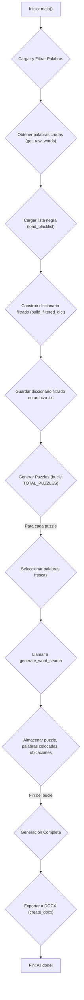
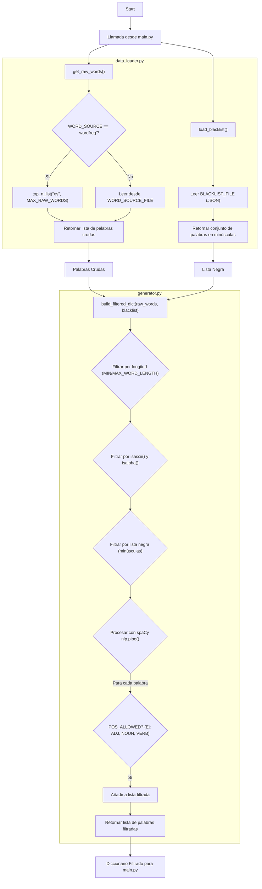
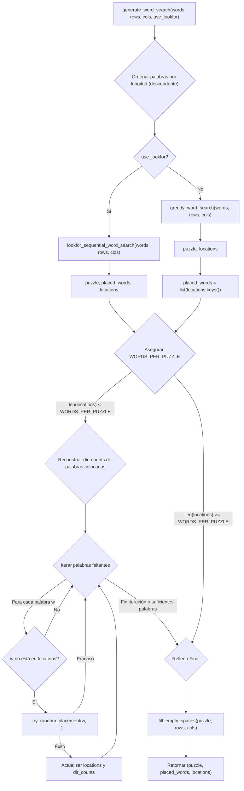
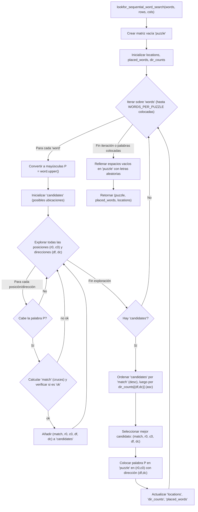
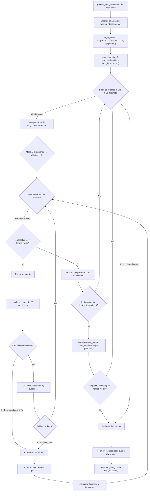
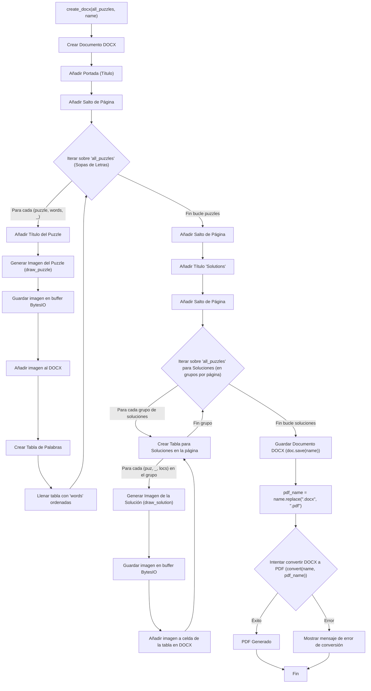

# Generador de Sopas de Letras

Este proyecto es una herramienta de Python para generar automáticamente sopas de letras personalizables y exportarlas a formatos DOCX y PDF.

## Características

Este proyecto ofrece dos interfaces para la generación de sopas de letras: una aplicación web interactiva y la utilidad de línea de comandos original.

**Características Comunes (Lógica Subyacente):**
* Generación de múltiples sopas de letras.
* Selección de palabras desde una fuente configurable (archivo de texto local o la biblioteca `wordfreq` para palabras comunes en español).
* Filtrado de palabras por longitud, tipo gramatical (usando spaCy) y una lista negra personalizable.
* Dos algoritmos de colocación de palabras:
  * **Secuencial (`lookfor`):** Intenta colocar palabras secuencialmente, maximizando cruces. Ideal para sopas de letras más densas.
  * **Voraz (`greedy`):** Intenta colocar palabras de forma voraz, priorizando las más largas y buscando buenos encajes.
* Exportación de los puzzles generados a formato DOCX, incluyendo las sopas de letras, las listas de palabras utilizadas y las páginas de soluciones.
* Configuración flexible de la generación (aunque la interfaz web expone los parámetros más comunes de forma interactiva, mientras que la CLI depende de `config.py`).

**Interfaz de Aplicación Web:**
* Interfaz gráfica fácil de usar para configurar y generar sopas de letras.
* Permite subir archivos de palabras y listas negras directamente desde el navegador.
* Previsualización de las sopas de letras generadas como imágenes en el navegador.
* Exportación directa de los puzzles generados a un único archivo DOCX.
* Estilos CSS para una mejor experiencia de usuario.
* Pruebas unitarias básicas con Pytest.

**Interfaz de Línea de Comandos (CLI):**
* Generación basada en la configuración definida en `config.py`.
* Visualización del progreso en la consola mediante `tqdm`.
* Conversión automática opcional de DOCX a PDF (ver nota sobre dependencias).

*(Nota sobre `docx2pdf`): La conversión automática de DOCX a PDF, presente en la versión CLI original, es una funcionalidad opcional que depende de tener Microsoft Word (en Windows) o LibreOffice (en macOS/Linux) instalado y accesible en el PATH del sistema. Esta conversión puede ser propensa a errores y no está integrada en la interfaz web, la cual se enfoca en la exportación a DOCX.*

## Estructura del Proyecto y Módulos

El proyecto está organizado en varios módulos de Python, cada uno con una responsabilidad específica:

* **`main.py`**: Orquesta todo el proceso: carga de datos, generación de sopas de letras y exportación.
* **`config.py`**: Contiene todas las constantes y parámetros de configuración del generador (dimensiones del puzzle, número de palabras, fuentes de palabras, etc.).
* **`data_loader.py`**: Responsable de cargar la lista de palabras crudas (desde un archivo o `wordfreq`) y la lista negra de palabras.
* **`generator.py`**: Contiene la lógica principal para la generación de las sopas de letras.
  * `build_filtered_dict()`: Filtra la lista de palabras crudas según los criterios definidos (longitud, tipo gramatical, lista negra).
  * `generate_word_search()`: Coordina el algoritmo de generación seleccionado (`lookfor` o `greedy`) y asegura que se coloque el número deseado de palabras, rellenando los espacios vacíos al final.
* **`lookfor.py`**: Implementa el algoritmo `lookfor_sequential_word_search` que coloca palabras secuencialmente intentando maximizar los cruces entre ellas.
* **`greedy.py`**: Implementa el algoritmo `greedy_word_search` que intenta colocar palabras de forma voraz, priorizando las más largas y buscando buenos encajes.
* **`greedy_utils.py`**: Funciones de utilidad para el algoritmo `greedy`.
* **`word_placement.py`**: Funciones relacionadas con la colocación de palabras en la matriz y el relleno de espacios vacíos.
* **`placement_utils.py`**: Utilidades generales para la colocación de palabras, como intentos de colocación aleatoria.
* **`export_docx.py`**: Maneja la creación del documento DOCX, incluyendo las sopas de letras, las listas de palabras y las páginas de soluciones. También invoca la conversión a PDF.
* **`drawing.py`**: Funciones auxiliares para dibujar las sopas de letras y las soluciones usando `matplotlib` para su inserción en el DOCX.
* **`check_words.py`**: Un script de utilidad para probar rápidamente la generación de puzzles y la colocación de palabras.
* **`blacklist.json`**: Archivo JSON que contiene palabras a excluir de la generación.

## Diagramas de Flujo (Mermaid)

### 1. Flujo de Ejecución Principal (`main.py`)


```mermaid
graph TD
    A["Inicio: main()"] --> B{"Cargar y Filtrar Palabras"};
    B --> C{"Obtener palabras crudas (get_raw_words)"};
    C --> D{"Cargar lista negra (load_blacklist)"};
    D --> E{"Construir diccionario filtrado (build_filtered_dict)"};
    E --> F{"Guardar diccionario filtrado en archivo .txt"};
    F --> G{"Generar Puzzles (bucle TOTAL_PUZZLES)"};
    G -- Para cada puzzle --> H{"Seleccionar palabras frescas"};
    H --> I{"Llamar a generate_word_search"};
    I --> J{"Almacenar puzzle, palabras colocadas, ubicaciones"};
    J -- Fin del bucle --> K{"Generación Completa"};
    K --> L{"Exportar a DOCX (create_docx)"};
    L --> M["Fin: All done!"];
```

### 2. Carga y Filtrado de Palabras


```mermaid
graph TD
    subgraph data_loader.py
        A["get_raw_words()"] --> A1{"WORD_SOURCE == 'wordfreq'?"};
        A1 -- Sí --> A2["top_n_list(&quot;es&quot;, MAX_RAW_WORDS)"];
        A1 -- No --> A3["Leer desde WORD_SOURCE_FILE"];
        A2 --> A4["Retornar lista de palabras crudas"];
        A3 --> A4;
        B["load_blacklist()"] --> B1["Leer BLACKLIST_FILE (JSON)"];
        B1 --> B2["Retornar conjunto de palabras en minúsculas"];
    end

    subgraph generator.py
        C["build_filtered_dict(raw_words, blacklist)"] --> C1{"Filtrar por longitud (MIN/MAX_WORD_LENGTH)"};
        C1 --> C2{"Filtrar por isascii() y isalpha()"};
        C2 --> C3{"Filtrar por lista negra (minúsculas)"};
        C3 --> C4{"Procesar con spaCy nlp.pipe()"};
        C4 -- Para cada palabra --> C5{"POS_ALLOWED? (Ej: ADJ, NOUN, VERB)"};
        C5 -- Sí --> C6["Añadir a lista filtrada"];
        C6 --> C7["Retornar lista de palabras filtradas"];
    end

    Start --> X["Llamada desde main.py"];
    X --> A;
    X --> B;
    A4 --> Y["Palabras Crudas"];
    B2 --> Z["Lista Negra"];
    Y --> C;
    Z --> C;
    C7 --> End["Diccionario Filtrado para main.py"];
```

### 3. Generación de Sopa de Letras (`generator.py - generate_word_search`)


```mermaid
graph TD
    A["generate_word_search(words, rows, cols, use_lookfor)"] --> B{"Ordenar palabras por longitud (descendente)"};
    B --> C{"use_lookfor?"};
    C -- Sí --> D["lookfor_sequential_word_search(words, rows, cols)"];
    D --> E["puzzle, placed_words, locations"];
    C -- No --> F["greedy_word_search(words, rows, cols)"];
    F --> G["puzzle, locations"];
    G --> H["placed_words = list(locations.keys())"];
    E --> I{"Asegurar WORDS_PER_PUZZLE"};
    H --> I;
    I -- len(locations) < WORDS_PER_PUZZLE --> J{"Reconstruir dir_counts de palabras colocadas"};
    J --> K{"Iterar palabras faltantes"};
    K -- Para cada palabra w --> L{"w no está en locations?"};
    L -- Sí --> M["try_random_placement(w, ...)"];
    M -- Éxito --> N["Actualizar locations y dir_counts"];
    N --> K;
    L -- No --> K;
    M -- Fracaso --> K;
    K -- Fin iteración o suficientes palabras --> O{"Relleno Final"};
    I -- len(locations) >= WORDS_PER_PUZZLE --> O;
    O --> P["fill_empty_spaces(puzzle, rows, cols)"];
    P --> Q["Retornar (puzzle, placed_words, locations)"];
```

### 4. Algoritmo Secuencial (`lookfor.py - lookfor_sequential_word_search`)


```mermaid
graph TD
    A["lookfor_sequential_word_search(words, rows, cols)"] --> B["Crear matriz vacía 'puzzle'" ];
    B --> C["Inicializar locations, placed_words, dir_counts"];
    C --> D{"Iterar sobre 'words' (hasta WORDS_PER_PUZZLE colocadas)"};
    D -- Para cada 'word' --> E["Convertir a mayúsculas P = word.upper()"];
    E --> F["Inicializar 'candidates' (posibles ubicaciones)"];
    F --> G{"Explorar todas las posiciones (r0, c0) y direcciones (df, dc)"};
    G -- Para cada posición/dirección --> H{"Cabe la palabra P?"};
    H -- Sí --> I{"Calcular 'match' (cruces) y verificar si es 'ok'"};
    I -- ok --> J["Añadir (match, r0, c0, df, dc) a 'candidates'" ];
    J --> G;
    H -- No --> G;
    I -- no ok --> G;
    G -- Fin exploración --> K{"Hay 'candidates'?"};
    K -- No --> D;
    K -- Sí --> L["Ordenar 'candidates' por 'match' (desc), luego por dir_counts[(df,dc)] (asc)"];
    L --> M["Seleccionar mejor candidato: (match, r0, c0, df, dc)"];
    M --> N["Colocar palabra P en 'puzzle' en (r0,c0) con dirección (df,dc)"];
    N --> O["Actualizar 'locations', 'dir_counts', 'placed_words'" ];
    O --> D;
    D -- Fin iteración o palabras colocadas --> P["Rellenar espacios vacíos en 'puzzle' con letras aleatorias"];
    P --> Q["Retornar (puzzle, placed_words, locations)"];
```

### 5. Algoritmo Voraz (`greedy.py - greedy_word_search`)


```mermaid
graph TD
    A["greedy_word_search(words, rows, cols)"] --> B["Ordenar palabras por longitud (descendente)"];
    B --> C["target_words = min(WORDS_PER_PUZZLE, len(words))"];
    C --> D["max_attempts = 3, best_puzzle = None, best_locations = {}"];
    D --> E{"Bucle de intentos (hasta max_attempts)"};
    E -- Intento actual --> F["Crear puzzle vacío, dir_counts, locations"];
    F --> G{"Mezclar direcciones (si attempt > 0)"};
    G --> H{"Iterar sobre 'words' ordenadas"};
    H -- Para cada 'word' --> I{"len(locations) >= target_words?"};
    I -- Sí --> H_End["Fin iteración palabras para este intento"];
    I -- No --> J["P = word.upper()"];
    J --> K["_explore_candidates(P, puzzle, ...)"];
    K --> L{"Candidato encontrado?"};
    L -- Sí (best_candidate_info) --> M["Extraer (r0, c0, df, dc)"];
    L -- No --> N["_fallback_placement(P, puzzle, ...)"];
    N --> O{"Fallback exitoso?"};
    O -- Sí (fallback_info) --> M;
    O -- No --> H;
    M --> P["Colocar palabra P en puzzle"];
    P --> Q["Actualizar locations y dir_counts"];
    Q --> H;
    H_End --> R{"len(locations) > len(best_locations)?"};
    R -- Sí --> S["Actualizar best_puzzle, best_locations (copia profunda)"];
    S --> T{"len(best_locations) >= target_words?"};
    T -- Sí --> E_End["Fin bucle de intentos"];
    T -- No --> E;
    R -- No --> E;
    E -- Fin bucle de intentos --> E_End;
    E_End --> U["fill_empty_spaces(best_puzzle, rows, cols)"];
    U --> V["Retornar (best_puzzle, best_locations)"];
```

### 6. Exportación a DOCX y PDF (`export_docx.py - create_docx`)


```mermaid
graph TD
    A["create_docx(all_puzzles, name)"] --> B["Crear Documento DOCX"];
    B --> C["Añadir Portada (Título)"];
    C --> D["Añadir Salto de Página"];
    D --> E{"Iterar sobre 'all_puzzles' (Sopas de Letras)"};
    E -- Para cada (puzzle, words, _) --> F["Añadir Título del Puzzle"];
    F --> G["Generar Imagen del Puzzle (draw_puzzle)"];
    G --> H["Guardar imagen en buffer BytesIO"];
    H --> I["Añadir imagen al DOCX"];
    I --> J["Crear Tabla de Palabras"];
    J --> K["Llenar tabla con 'words' ordenadas"];
    K --> E;
    E -- Fin bucle puzzles --> L["Añadir Salto de Página"];
    L --> M["Añadir Título 'Solutions'" ];
    M --> N["Añadir Salto de Página"];
    N --> O{"Iterar sobre 'all_puzzles' para Soluciones (en grupos por página)"};
    O -- Para cada grupo de soluciones --> P["Crear Tabla para Soluciones en la página"];
    P -- Para cada (puz, _, locs) en el grupo --> Q["Generar Imagen de la Solución (draw_solution)"];
    Q --> R["Guardar imagen en buffer BytesIO"];
    R --> S["Añadir imagen a celda de la tabla en DOCX"];
    S --> P;
    P -- Fin grupo --> O;
    O -- Fin bucle soluciones --> T["Guardar Documento DOCX (doc.save(name))"];
    T --> U["pdf_name = name.replace(&quot;.docx&quot;, &quot;.pdf&quot;)"];
    U --> V{"Intentar convertir DOCX a PDF (convert(name, pdf_name))"};
    V -- Éxito --> W["PDF Generado"];
    V -- Error --> X["Mostrar mensaje de error de conversión"];
    W --> Z["Fin"];
    X --> Z;
```

## Configuración (`config.py`)

El archivo `config.py` centraliza todos los parámetros ajustables del generador, especialmente para la **interfaz de línea de comandos (CLI)**. Muchos de estos valores actúan como **valores por defecto** para la interfaz web si no se especifican en el formulario. Algunos de los más importantes son:

* `TOTAL_PUZZLES`: Número total de sopas de letras a generar.
* `WORDS_PER_PUZZLE`: Número deseado de palabras a colocar en cada sopa.
* `PUZZLE_ROWS`, `PUZZLE_COLUMNS`: Dimensiones de la cuadrícula.
* `WORD_SOURCE`: Fuente de las palabras (`"file"` o `"wordfreq"`).
* `WORD_SOURCE_FILE`: Ruta al archivo de texto si `WORD_SOURCE` es `"file"`.
* `BLACKLIST_FILE`: Ruta al archivo JSON de la lista negra.
* `MIN_WORD_LENGTH`, `MAX_WORD_LENGTH`: Longitud mínima y máxima de las palabras a considerar.
* `POS_ALLOWED`: Lista de etiquetas POS (Part-of-Speech) de spaCy permitidas para filtrar palabras (ej. `['NOUN', 'ADJ', 'VERB']`).
* `USE_LOOKFOR`: Booleano para seleccionar el algoritmo de generación (`True` para `lookfor`, `False` para `greedy`).
* `DIRECTIONS`: Lista de tuplas `(dr, dc)` que representan las direcciones posibles para colocar palabras.
* ... y muchos otros parámetros para controlar la apariencia de la exportación DOCX/PDF.

## Web Application Interface

Esta sección describe cómo ejecutar y utilizar la interfaz web para generar sopas de letras.

### Running the Web Application

1.  **Clonar el repositorio (si aún no lo has hecho):**
    ```bash
    git clone <URL_DEL_REPOSITORIO>
    cd <NOMBRE_DEL_REPOSITORIO>
    ```

2.  **Crear un entorno virtual (recomendado) y activarlo:**
    ```bash
    python -m venv venv
    # En Windows
    venv\Scripts\activate
    # En macOS/Linux
    source venv/bin/activate
    ```

3.  **Instalar dependencias:**
    Asegúrate de tener Python 3.x instalado. Luego, instala las bibliotecas necesarias usando el archivo `requirements.txt` proporcionado:
    ```bash
    pip install -r requirements.txt
    ```
    El modelo de lenguaje de spaCy (`es_core_news_lg`) está listado en `requirements.txt` con un enlace directo para su instalación. Si por alguna razón esto falla o prefieres instalarlo manualmente después, puedes usar:
    ```bash
    python -m spacy download es_core_news_lg
    ```

4.  **Ejecutar la aplicación Flask:**
    Una vez instaladas las dependencias, puedes iniciar la aplicación web.
    *   En Windows:
        ```bash
        set FLASK_APP=app.py
        flask run
        ```
    *   En macOS/Linux:
        ```bash
        export FLASK_APP=app.py
        flask run
        ```
    Por defecto, la aplicación estará disponible en tu navegador en `http://127.0.0.1:5000/`.

### Using the Web Interface

Al acceder a la aplicación en tu navegador, verás la página principal con un formulario de configuración:

*   **Number of Puzzles:** Cuántas sopas de letras diferentes generar.
*   **Words per Puzzle:** Número objetivo de palabras a incluir en cada sopa.
*   **Puzzle Rows/Columns:** Dimensiones de la cuadrícula para cada sopa de letras.
*   **Word Source File:** Permite subir un archivo de texto (`.txt`) con tu propia lista de palabras (una palabra por línea). Si se deja vacío, se utilizará la fuente de palabras por defecto configurada en el sistema (ej., `wordfreq`).
*   **Blacklist File:** Permite subir un archivo JSON (`.json`) con una lista de palabras que no deben incluirse en los puzzles.
*   **Use 'lookfor' algorithm:** Casilla para seleccionar el algoritmo "lookfor" (más denso y con más cruces). Si no se marca, se usará el algoritmo "greedy".

Una vez configurado, haz clic en "Generate Puzzles".

*   **Visualización de Puzzles:** Si la generación es exitosa, serás redirigido a una página que lista los puzzles generados. Desde aquí, puedes:
    *   Hacer clic en "View Puzzle" para ver una imagen de cada sopa de letras individualmente.
*   **Exportación a DOCX:** En la página de lista de puzzles, encontrarás un botón "Export All Puzzles to DOCX". Al hacer clic, se descargará un archivo `.docx` conteniendo todas las sopas de letras generadas, sus listas de palabras y las páginas de soluciones.
*   **Mensajes de Error/Advertencia:** Si ocurre algún problema (ej., archivo de palabras no encontrado, no se pueden colocar palabras con la configuración dada), la aplicación mostrará mensajes de error o advertencia en la parte superior de la página.

## Command-Line Interface (Original Version)

Esta sección describe cómo usar la versión original de la herramienta, a través de la línea de comandos.

1.  **Clonar el repositorio (si aún no lo has hecho):**

    ```bash
    git clone <URL_DEL_REPOSITORIO>
    cd <NOMBRE_DEL_REPOSITORIO>
    ```

2.  **Crear un entorno virtual (recomendado) y activarlo (si no lo hiciste para la app web):**
    ```bash
    python -m venv venv
    # En Windows
    venv\Scripts\activate
    # En macOS/Linux
    source venv/bin/activate
    ```

3.  **Instalar dependencias:**
    Utiliza el archivo `requirements.txt` que incluye todas las dependencias necesarias tanto para la CLI como para la aplicación web:
    ```bash
    pip install -r requirements.txt
    ```
    Para el modelo de spaCy, si no se instaló correctamente a través del enlace en `requirements.txt`:
    ```bash
    python -m spacy download es_core_news_lg
    ```
    *(Consulta la nota sobre `docx2pdf` en la sección "Características" si deseas exportar a PDF desde la CLI).*

4.  **Configurar:**
    Edita `config.py` para ajustar los parámetros de generación según tus necesidades (tamaño del puzzle, número de palabras, fuente de palabras, etc.). La CLI se basa enteramente en este archivo para su configuración.
    Prepara tu archivo de lista de palabras (si usas `WORD_SOURCE = "file"` en `config.py`) y/o tu `blacklist.json`.

5.  **Ejecutar:**
    ```bash
    python main.py
    ```

6.  **Resultados:**
    Los archivos DOCX (y PDF si la conversión es exitosa y `docx2pdf` está configurado) se guardarán en el directorio raíz del proyecto. También se generará un archivo `*_filtered.txt` con la lista de palabras utilizadas después del filtrado.

## Contribuir

Las contribuciones son bienvenidas. Por favor, abre un *issue* para discutir cambios importantes o envía un *pull request*.
